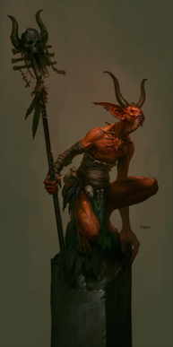

# Goran's Doom

A group of Daemon shaman that has decided the only way to end the obsidian war is to kill Goran himself. 
They’ve established themselves in the ruins to the south of Goran’s Isle, 
and are convinced that the key to the god’s destruction lies somewhere in the burned out city…

# Mov Petra

A band of growing numbers, no one is yet certain where their strange beliefs originated, but it must have been overseas as their patron goddess is not from the Nephilim. Made up primarily of down on their luck Nephilim, they gather around the Obelisk and seek the destruction of all non cult life in hopes of placing Narnova on the throne and inheriting the ashes of the world from which they can rebuild and live as kings.

[Main Page](README.md)
