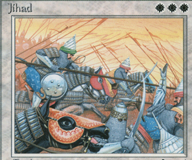
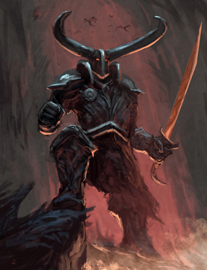

# ~~Goran's Doom~~

A group of Daemon shaman that has decided the only way to end the obsidian war is to kill Goran himself. 
They’ve established themselves in the ruins to the south of Goran’s Isle, 
and are convinced that the key to the god’s destruction lies somewhere in the burned out city…

After the end of the obsidian war, it became clear that the cult truly just desires the death of Goran, and were most pleased by the savage destruction of his mountain caverns… perhaps they are influenced by the god-killer Ankai?

They were destroyed by the barrow ravagers horde after the war, in retribution for their role in the destruction of the Obsidian Mines

# Mov Petra

A band of growing numbers, no one is yet certain where their strange beliefs originated, but it must have been overseas as their patron goddess is not from the Nephilim. Made up primarily of down on their luck Nephilim, they gather around the Obelisk and seek the destruction of all non cult life in hopes of placing Narnova on the throne and inheriting the ashes of the world from which they can rebuild and live as kings.

# Knights of Dagrond-Mau

After the destruction of the obsidian mines, the daemon commander Dagrond-mau kept a personal stockpile of the precious obsidian secret. The commander became convinced over time of two things: that the god Goran was destroyed by the destruction of the obsidian mines, and that the remaining gods of the land were nothing but blight upon it. In secrete, he gathered a group of greater daemons that survived the obsidian war, and convinced them to follow himself in worship of the no-god, a deity that represents the death and absence of all gods. Dagrond-mau used his personal supply of obsidian to outfit his followers in armor, and raided the markets of the Guild of Merchants to gain a stockpile of ancient weapons. Any faction that worships a deity is the enemy of The Knights, and any who stand in their way are to be utterly destroyed. They will not stop until they seize control of the daemon horde, and use it to do what Garag-nar cannot… rid the world of both Ankai and Narnova

[Main Page](README.md#table-of-contents)
