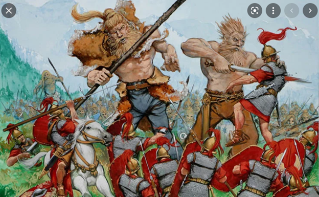

#  Barrows Ravagers

Driven from their home by the great and terrible *illegible*, the *illegible* fled to an adjacent world. Upon settling an abandoned island, they realized they had no natural resources whatsoever. 
After descending upon and slaying *illegible* (for it was he who scouted and chose the location to settle) it was discovered that the island was home to generation upon generation of barrows. The *illegible* were henceforth known as The Barrows Ravagers, they erected a fortress, and began mining the only resource available to them…..

#   Nephilim 
 

Long ago, war broke out in the heavens. Slaying as many of the gods as he could find, Ankai rose victorious. For their refusal to help aid Ankai in his quest for dominion, the Nephilim were cast from the skies and bound to the mortal realms. Long ages have past and the once destitute and broken Nephilim have grown into a burgeoning society, founding their capital city near the Deep wood, the Stronghold of Uruk.

[Main Page](README.md)
