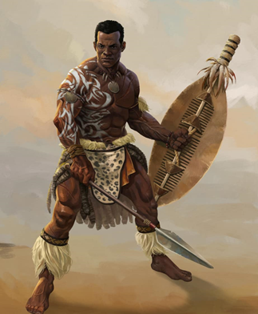
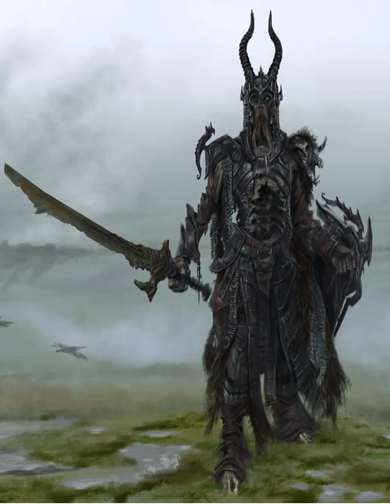

[Main Page](README.md#table-of-contents)

# ~~Blurag~~

Descendant of the great chief Urglablurgha, ascended to status of chieftan after killing his brothers in pitched combat (as is tradition, there can be only one heir). 
Lead the people of the Inganae through the Obsidian wars. 
Spent his younger years building up and defending the beach head fort of Goran’s Isle, and spent his midlife fighting against the daemons and Skaven. 
He brought the war to an end when he sacrificed himself to destroy the obsidian mines, as was surely Gorgon’s will.

[Main Page](README.md#table-of-contents)

# Grond, the Undying

An ancient warlord, entombed beneath the barrows long centuries ago. He was awakened when the Barrow Ravager's corpse miners broke into his tomb. He slaughtered all who he found trespassing his peoples sacred caverns. Now he stalks the crypts, immortal and unforgiving...
